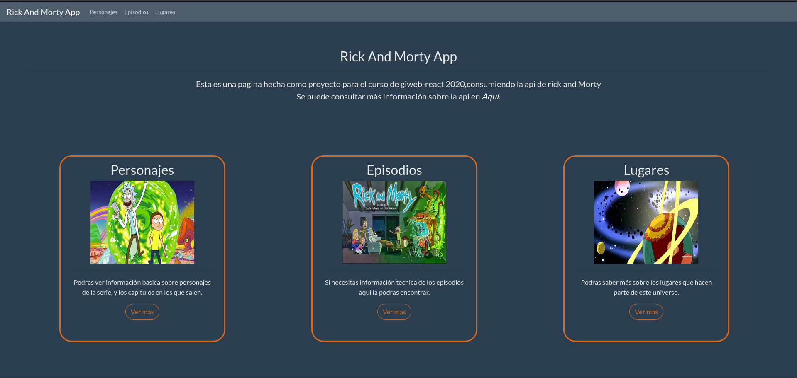

# Rick and Morty App

Proyecto del curso de Giweb-React consumiendo la api de rick and morty (https://rickandmortyapi.com/)

## Autor
- Sergio David Paez Suarez

## Uso en modo desarrollo

- `git clone https://github.com/spaezsuarez/Rick_and_Morty_App.git`
- `cd Rick_and_Mory_App`
- `npm i`
- `npm start`

El siguiente output deberia aparecer por terminal

dirigirse a [localhost](http://127.0.0.1:4000/)

## Vistas
- Home

- Pagina de Personajes

- Pagina de detalle de un personaje

- Pagina de Episodios

- Pagina de detalle de un Episodio

- Pagina de Lugares

- Pagina de detalle de un Lugar
